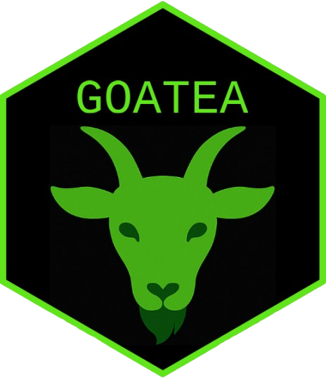

<!-- README.md is generated from README.Rmd. Please edit that file -->

```{r, include = FALSE}
knitr::opts_chunk$set(
  collapse = TRUE,
  comment = "#>",
  fig.path = "man/figures/README-",
  out.width = "100%"
)
```

<!-- badges: start -->
[](https://bioconductor.org/checkResults/release/bioc-LATEST/goatea)
[](https://www.repostatus.org/#active)
[](https://lifecycle.r-lib.org/articles/stages.html#stable)
[](https://opensource.org/license/apache-2-0)


<!-- badges: end -->

# goatea 

Geneset Ordinal Association Test Enrichment Analysis (GOATEA) provides a Shiny interface with interactive visualizations and utility functions for performing and exploring automated gene set enrichment analysis using the ‘GOAT’ package.

GOATEA is designed to support large-scale and user-friendly enrichment workflows across multiple gene lists and comparisons, with flexible plotting and output options. Visualizations pre-enrichment include interactive Volcano and UpSet (overlap) plots. Visualizations post-enrichment include interactive geneset split term dotplot, geneset hierarchical clustering treeplot, multi-genelist gene-effectsize heatmap, enrichment overview gene-geneset heatmap and bottom-up pathway-like STRING database of protein-protein-interactions network graph.

# Installation

The development version of goatea is available through Github, I intend for goatea to become available through Bioconductor. 

```{r installation, eval = FALSE}
## GOATEA installation requires the latest version of R and Rtools 
## Rtools is needed for package compilation, to download and install visit: 
# R: https://cran.r-project.org/mirrors.html
# Rtools: https://cran.r-project.org/bin/windows/Rtools/

# For the GOATEA development version use: 
if ( ! require("pak", quietly = TRUE)) install.packages('pak')
pak::pkg_install('mauritsunkel/goatea')

## When GOATEA is on Bioconductor use: 
# pak::pkg_install('goatea', dependencies = TRUE, upgrade = TRUE)

## goatea organism (taxid) genome wide annotation packages (org.Xx.eg.dg)
## goatea requires at least one of the following available organism packages:
# Human (9606)--------: org.Hs.eg.db
# Mouse (10090)-------: org.Mm.eg.db
# Fruit Fly (7227)----: org.Dm.eg.db
# Rhesus monkey (9544): org.Mmu.eg.db
# Rat (10116)---------: org.Rn.eg.db
# Worm (6239)---------: org.Ce.eg.db
# Chimpanzee (9598)---: org.Pt.eg.db
# Zebrafish (7955)----: org.Dr.eg.db
if ( ! require("pak", quietly = TRUE)) install.packages('pak')
pak::pkg_install(c(
  "org.Hs.eg.db", 
  "org.Mm.eg.db", 
  "org.Dm.eg.db", 
  "org.Mmu.eg.db", 
  "org.Rn.eg.db", 
  "org.Ce.eg.db", 
  "org.Pt.eg.db", 
  "org.Dr.eg.db"
))

## Optional: add gene descriptions to exported tables, install annotables:
# available only for: human, mouse, rat, worm, fruit fly, Rhesus Monkey
if ( ! require("pak", quietly = TRUE)) install.packages('pak')
pak::pkg_install('stephenturner/annotables')
```

# Running goatea: Shiny application

Simply install the package and its dependencies, then run the code below in R. 

Note that the goatea color scheme is easily customizable, have fun creating your own theme! 

Click the '?' buttons and hover over UI elements for explanation in tooltips. 

```{r goatea Shiny, eval=FALSE, message=FALSE, warning=FALSE}
library(goatea)

## customizable coloring
colors <- list(
  main_bg = "#222222",
  darker_bg = "#111111",
  focus = "#32CD32", 
  hover = "#228B22",
  border = "#555555",
  text = "#FFFFFF"
)

## run the goatea Shiny application
shiny::shinyApp(
  ui = goatea:::goatea_ui,
  server = function(input, output, session) {
    goatea:::goatea_server(
      input, output, session, 
      css_colors = colors)
  }
)
```

# Running goatea: automated analyses 

See the [vignette](https://mauritsunkel.github.io/goatea/goatea.html) for more details on automated scripted analyses.

# GOAT reference

Koopmans, F. GOAT: efficient and robust identification of gene set enrichment. Commun Biol 7, 744 (2024). https://doi.org/10.1038/s42003-024-06454-5

# Contact 

A thank you for your time and effort in using goatea, I hope it may aid you in exploring your data! 

For issues: https://github.com/mauritsunkel/goatea/issues

To collaborate, pull request or email me: mauritsunkel@gmail.com

# FAQ 

Why does my file not download? 
* For PPI: check if the string database website is online. 
* Generally: make sure you have read/write permissions in the set base folder.


