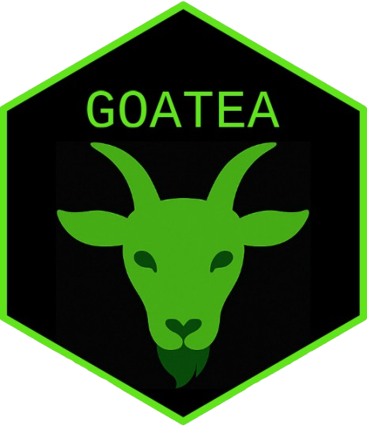

<!-- README.md is generated from README.Rmd. Please edit that file -->

<!-- badges: start -->

<!-- badge: bioc-downloads --> <!-- badges: end -->

# goatea 

Geneset Ordinal Association Test Enrichment Analysis (GOATEA) provides a
Shiny interface with interactive visualizations and utility functions
for performing and exploring automated gene set enrichment analysis
using the ‘GOAT’ package.

GOATEA is designed to support large-scale and user-friendly enrichment
workflows across multiple gene lists and comparisons, with flexible
plotting and output options. Visualizations pre-enrichment include
interactive Volcano and UpSet (overlap) plots. Visualizations
post-enrichment include interactive geneset split term dotplot, geneset
hierarchical clustering treeplot, multi-genelist gene-effectsize
heatmap, enrichment overview gene-geneset heatmap and bottom-up
pathway-like STRING database of protein-protein-interactions network
graph.

# Running goatea: Shiny application GUI or R package

All vignettes can be found in the [pkgdown
documentation](https://mauritsunkel.github.io/goatea)

For an application demonstration, see the [GUI
vignette](https://mauritsunkel.github.io/goatea/articles/goatea_GUI.html).

Example Colameo et al. 2021 data .csvs as used in the manuscript and for
demonstrations can be downloaded in the data/ folder.

Easiest: run GOATEA in your web browser via HuggingFace Docker
container: <https://huggingface.co/spaces/Mausaya/GOATEA> Note: this may
be slower, as 16GB RAM and 2CPU are shared across all users.
Specifically for loading large datasets like the GO annotations via
AnnotationDbi can take up to minutes. In all cases, as long as the
loader animation is running, the application is working on the
background.

If this runs too slow, I suggest you run GOATEA via local R, see the
steps for this in the [GUI
vignette](https://mauritsunkel.github.io/goatea/articles/goatea_GUI.html).

If for any reason the current and Bioconductor versions do not install,
you can always resolve to running the GOATEA Docker container, also
explained in the [GUI
vignette](https://mauritsunkel.github.io/goatea/articles/goatea_GUI.html).

------------------------------------------------------------------------

For more technical users, if you are interested in making your own
pipeline or scripts with GOATEA functions to maximize throughput, see
the [R package
vignette](https://mauritsunkel.github.io/goatea/articles/goatea.html).

# GOAT reference

Koopmans, F. GOAT: efficient and robust identification of gene set
enrichment. Commun Biol 7, 744 (2024).
<https://doi.org/10.1038/s42003-024-06454-5>

# Contact

A thank you for your time and effort in using goatea, I hope it may aid
you in exploring your data!

For issues: <https://github.com/mauritsunkel/goatea/issues>

To collaborate, pull request or email me: <mauritsunkel@gmail.com>

# Frequently Asked Questions (FAQ)

Why does my file not download?

- For PPI: check if the string database website is online.
- Generally: make sure you have read/write permissions in the set base
  folder.

How can I download and use example data?

- The Colameo et al. example data used in the manuscript and vignettes
  is internally available via goatea:::example_Colameo_data
- The Colameo et al. example data is also available for download via the
  GitHub repository in the inst/extdata/ folder.
- This example data can also be loaded in R with: example_Colameo_data
  \<- goat::download_goat_manuscript_data(output_dir = tempdir())\[1:2\]

Why do ggplot2 warning messages appear when I run the code?

- These warnings are often related to the ggplot2 package and can be
  safely ignored. They do not affect the functionality of the code or
  the resulting plots. If you want to suppress these warnings, you can
  use the `suppressWarnings()` function in R around the code that
  generates the plots.

Why might the statistics on the termtree plot be ‘off’?

- As the ‘enrichplot’ package used on the background no longer allows
  for GOAT enrichment to be converted to the class needed for plotting
  their ‘treeplot’, I rerun a local over-representation analysis on all
  genes of the selected genelist versus the selected genesets of the
  current enrichment view. Use this plot to visualize the hierarchy,
  clusters and gene set size of the genesets (terms).
