  
```{r options, include = FALSE, echo = FALSE, results = 'asis',}
knitr::opts_chunk$set(
  echo = TRUE,
  collapse = TRUE, 
  comment = "#>",
  
  fig.width = 9,      # Makes the internal plot larger
  fig.height = 6,
  out.width = "100%", # Scales it to fit the screen
  fig.alt = " ",
  fig.align = "center",
  fig.path = 'man/images/'
)
BiocStyle::markdown()
```


# Introduction

Geneset Ordinal Association Test Enrichment Analysis (GOATEA) provides a Shiny interface with interactive visualizations and utility functions for performing and exploring automated gene set enrichment analysis using the 'goat' package. 

GOATEA is designed to support large-scale and user-friendly enrichment workflows across multiple gene lists and comparisons, with flexible plotting and output options. Visualizations pre-enrichment include interactive Volcano and UpSet (overlap) plots. Visualizations post-enrichment include interactive geneset split term dotplot, geneset hierarchical clustering treeplot, multi-genelist gene-effectsize heatmap, enrichment overview gene-geneset heatmap and bottom-up pathway-like STRING database of protein-protein-interactions network graph.

## Why use goatea? 

Some enrichment visualization packages are included in Bioconductor, for instance: enrichplot, vissE, CBNplot. 
goatea additionally provides interactive visualizations through an intuitive and customizable Shiny user interface and allows for multi-genelist comparisons. No bioinformatic expertise is needed. goatea includes commonly used visualizations and adds a novel enrichment overview heatmap and offers a bottom-up pathway-like protein-protein interaction graph with network statistics.

A number of enrichment analysis packages are already on Bioconductor: clusterProfiler, fgsea, DOSE and many more. 
In goatea, goat is implemented. goat is a novel method for efficient geneset enrichment analysis. It performs within seconds and results in more identified significant terms compared to other methods, see the reference. For researchers with coding expertise, goatea provides an automated analysis workflow for performing enrichment analysis with goat and obtaining overview tables and output figures to explore your data. 

## How goatea works 

Genelists are often obtained from transcriptomic and/or proteomic experiments. These genelist tables have to contain a 'gene' column with NCBI Entrez gene identifiers, a 'symbol' column with gene aliases (optional: can be mapped from their gene IDs), and 'effectsize' and 'pvalue' columns with measurement outcomes for a performed comparison. User defined thresholds for effect size and p-values are used to define gene significance. To get a first look and understanding of your genelist data, a volcano plot is provided. For multi-genelist data a UpSet (overlap) plot can additionally be generated to visualize significant genes between comparisons. 

Genesets can be obtained by downloading Gene Ontology organism specific genesets within goatea or from .gmt files, downloaded for instance from the Molecular Signatures Database. Genelist genes and genesets will be filtered and matched, then goat or an older version of gene set enrichment analysis can be performed. Extensive filtering options help you to explore only the terms and genes within your vision.

Post-enrichment visualizations help to identify genes and terms of interest or relevance for your experimental design. Identified and selected genes of interest are then used to specifically visualize your data by zooming in on specific biological or technical aspects. 

The steps above can be automated, an example workflow is described in the rest of this vignette.  

As intended for interactive and intuitive usage, run the goatea Shiny interface.


# Running GOATEA: Shiny application - Graphical User Interface (GUI) 

If you are interested in making your own pipeline or scripts with GOATEA functions, see the R package usage vignette: LINK

## Web browser - HuggingFace Docker container

The easiest and fastest way to run GOATEA is in your browser via HuggingFace: https://huggingface.co/spaces/Mausaya/GOATEA  


Note: this may be somewhat slower, as 16GB RAM and 2CPU are shared across all users and if the Docker container is 'sleeping' it might take a minute to start up. 

## Local: via R(studio) or Docker

### Installation 

First we have to install GOATEA.
The GOATEA developer version is available through GitHub, GOATEA is also available on Bioconductor. 

```{r installation, eval = FALSE}
## GOATEA installation requires R (v4.5.0) and the lastest version of Rtools 
## Rtools is needed for package compilation, to download and install visit: 
# R: https://cran.r-project.org/mirrors.html
# Rtools: https://cran.r-project.org/bin/windows/Rtools/
## I recommend to run the installation and GUI startup code via Rstudio, to have a nice graphical environment: 
# Rstudio: https://posit.co/downloads/

## To install GOATEA from Bioconductor (v3.23) use:
if (!requireNamespace("BiocManager", quietly=TRUE)) install.packages("BiocManager")
BiocManager::install("goatea")
# or via pak
if ( ! require("pak", quietly = TRUE)) install.packages('pak')
pak::pkg_install('goatea', dependencies = TRUE, upgrade = TRUE)

## goatea requires at least one of the following available organism genome wide annotation packages:
### format: organism (taxid): org.Xx.eg.dg
# Human (9606)--------: org.Hs.eg.db
# Mouse (10090)-------: org.Mm.eg.db
# Fruit Fly (7227)----: org.Dm.eg.db
# Rhesus monkey (9544): org.Mmu.eg.db
# Rat (10116)---------: org.Rn.eg.db
# Worm (6239)---------: org.Ce.eg.db
# Chimpanzee (9598)---: org.Pt.eg.db
# Zebrafish (7955)----: org.Dr.eg.db
if ( ! require("pak", quietly = TRUE)) install.packages('pak')
pak::pkg_install(c(
  "org.Hs.eg.db", 
  "org.Mm.eg.db", 
  "org.Dm.eg.db", 
  "org.Mmu.eg.db", 
  "org.Rn.eg.db", 
  "org.Ce.eg.db", 
  "org.Pt.eg.db", 
  "org.Dr.eg.db"
))
```

### Running goatea Shiny GUI: via R(studio)

Note that the goatea color scheme is easily customizable, have fun creating your own theme! 

```{r goatea_Shiny, eval=FALSE, message=FALSE, warning=FALSE}
library(goatea)

## customizable coloring
colors <- list(
  main_bg = "#222222",
  darker_bg = "#111111",
  focus = "#32CD32", 
  hover = "#228B22",
  border = "#555555",
  text = "#FFFFFF"
)

## set max file size to ...MB for uploads (default: 100)
options(shiny.maxRequestSize = 1024^2 * 100)

## run the goatea Shiny application
shiny::shinyApp(
  ui = goatea_ui,
  server = function(input, output, session) {
    goatea_server(
      input, output, session, 
      css_colors = colors)
  }
)
```

### Running goatea Shiny GUI: via Docker

If for any reason the standard GOATEA installation is not working, or you want to use an older version of GOATEA, a pre-built Docker image will always be able to run! 
This might be for more technical users, although the steps below should be easy enough to follow. 


Install Docker on your computer: https://docs.docker.com/engine/install/

The following commands, run them in a terminal window (Windows: cmd/Powershell).

Download the pre-built GOATEA Docker image via GitHub packages  
- latest: docker pull ghcr.io/mauritsunkel/goatea:latest  
- release: check https://github.com/mauritsunkel/goatea/pkgs/container/goatea and change the command above to fit the release version  

Run Docker image: docker run -d -p 8080:7860 --name goatea-app ghcr.io/mauritsunkel/goatea:latest

Then open your web browser and navigate to: http://localhost:8080/

And you are all set! 

# GOATEA GUI demonstration

Note that all plots in the vignette are clickable to full screen, in case the images load too small. 

In general, you can click the '?' buttons and hover over most UI elements for explanations in popups and tool tips. 

In this demonstration, we utilize the easy to access HuggingFace web browser tool.
As in the manuscript and package demonstration, we again use the Colameo et al. example dataset that is packaged and shipped with GOATEA. If you still have trouble finding the example data, see the FAQ on the GitHub page: https://github.com/mauritsunkel/goatea?tab=readme-ov-file#faq


## Initialization - load data

When starting the GOATEA GUI, you land on the 'initialization - load data' tab. On top you see the global options, used throughout the rest of the app. 

In the genelists pane I've uploaded the example Colameo et al. MS and RNA data, as described in the GOATEA manuscript. On clicking browse, the example data folder should open for easy access. I set significant genes (or proteins) and sample names. 

<a href="images/GOATEA_GUI_load_data.png" target="_blank" rel="noopener">
  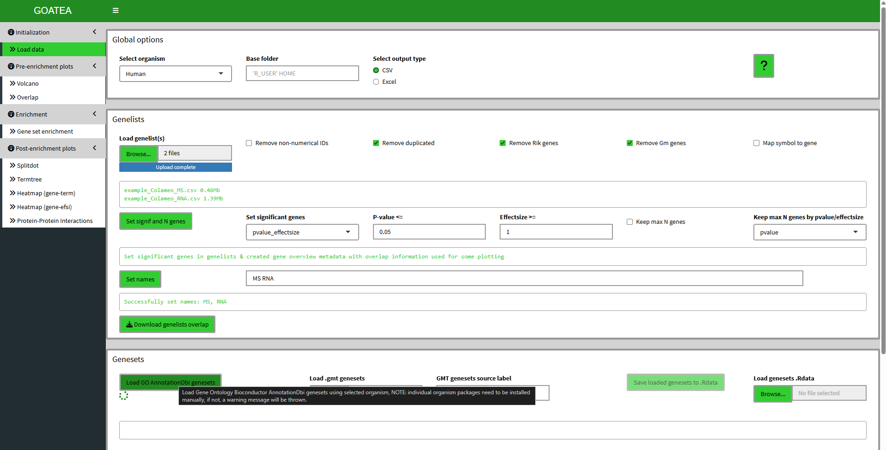
</a>

Usage and parameters are explained through '?' popup documentation and hover tool tips. 

In the genesets pane, you can see the loading animation underneath the button while anything is loading on the background. I mouse hover the load button to show the tool tip explanation, that is available for most UI elements.  

In general, for any tab GUI logic questions and workflow you can click the '?' button and a popup with documentation will be shown to it, simply click on the side of it when done reading.

<a href="images/GOATEA_GUI_question_button.png" target="_blank" rel="noopener">
  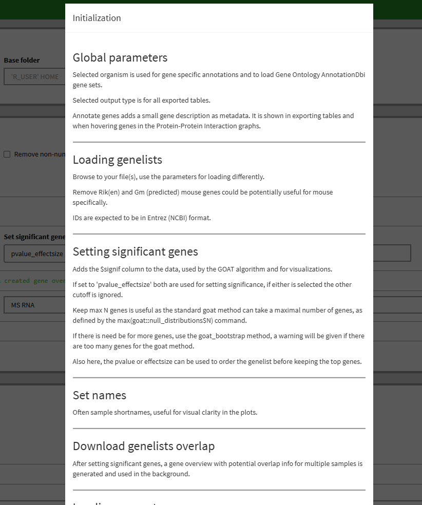
</a>

When done on a tab, you can either use the navigation buttons on the bottom of any tab, as shown in example below, or simply click the tab in the left sidebar menu. 

<a href="images/GOATEA_GUI_navigation_buttons.png" target="_blank" rel="noopener">
  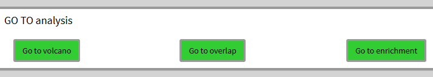
</a>
Clicking in 'Go to volcano', we go to the next tab. 

## Pre-enrichment visualization - Volcano plot

After changing the sample to 'RNA' and clicking the plot button the tab shows the following volcano plot. This interactive plotly plot is hoverable to show point (gene/protein) information. All plots are exportable with a button (right) below the plot. 

Here, points can be selected by mouse dragging a box around them and clicking the 'add selected genes' button. 

<a href="images/GOATEA_GUI_volcano.png" target="_blank" rel="noopener">
  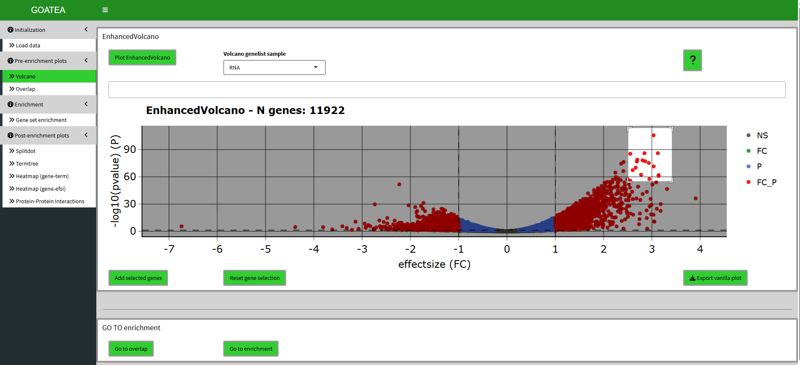
</a>

## Pre-enrichment visualization - Overlap (UpSet) plot

Now we 'go to overlap' and click plot with the default distinct mode still on. Here I select the 484 genes that are overlapping by clicking the far right histogram and first click 'reset gene selection' before 'add set genes'. These selected genes/proteins are later used in the gene-effectsize heatmap and protein-protein interaction graph. 

<a href="images/GOATEA_GUI_overlap.png" target="_blank" rel="noopener">
  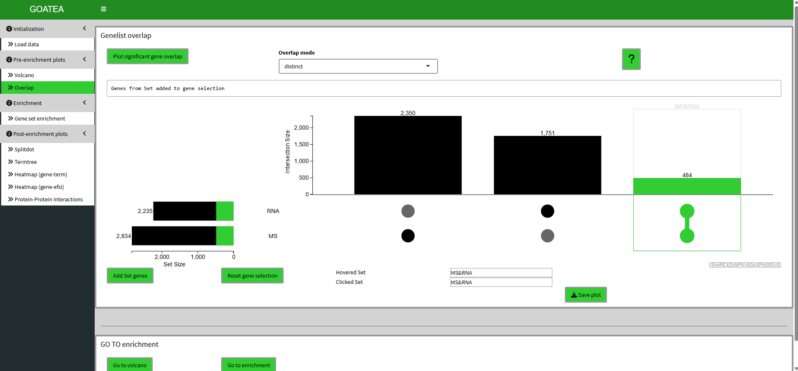
</a>

## Enrichment with GOAT

Next we 'go to enrichment', leave parameters at default and utilize the GOAT algorithm with 'run enrichment'! Here we see a lot of output. The table now shows the current enrichment for the selected sample and selected enrichment source. All enrichments or the currently shown enrichment can be exported. Underneath the table there are many filtering options that work together in parallel. For this example I leave defaults except 'synap' for 'query terms' and hit 'filter enrichments'. The filtering is performed for all samples. Filtering can be reset by clicking the 'reset filtered enrichments' button on the top right of the table. 

IMPORTANT: the current shown (filtered) enrichment is used for the splitdot, termtree and gene-genesets heatmap visualizations! 

<a href="images/GOATEA_GUI_enrichment.png" target="_blank" rel="noopener">
  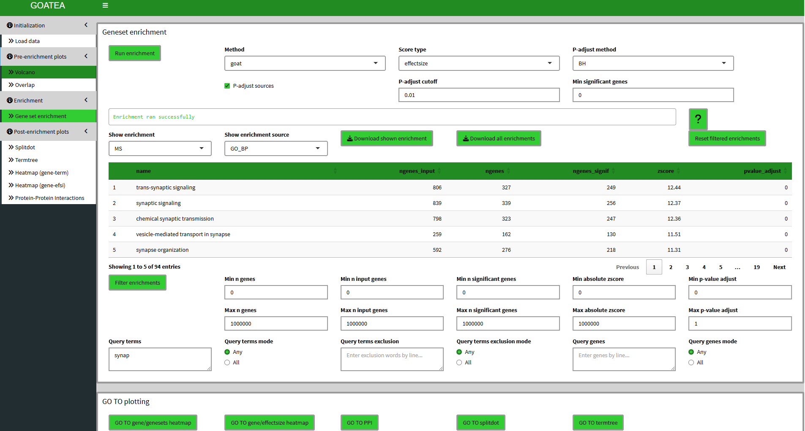
</a>

## Post-enrichment visualization: split-dot plot

We then 'GO TO splitdot', set 'top N terms' to 25 and drag the slider at the bottom right to the right to scale the plot size. 

This plot is meant to show a quick overview of top enriched genesets, showing gene ratio, N genes in geneset and adjusted p-value. 

<a href="images/GOATEA_GUI_splitdot.png" target="_blank" rel="noopener">
  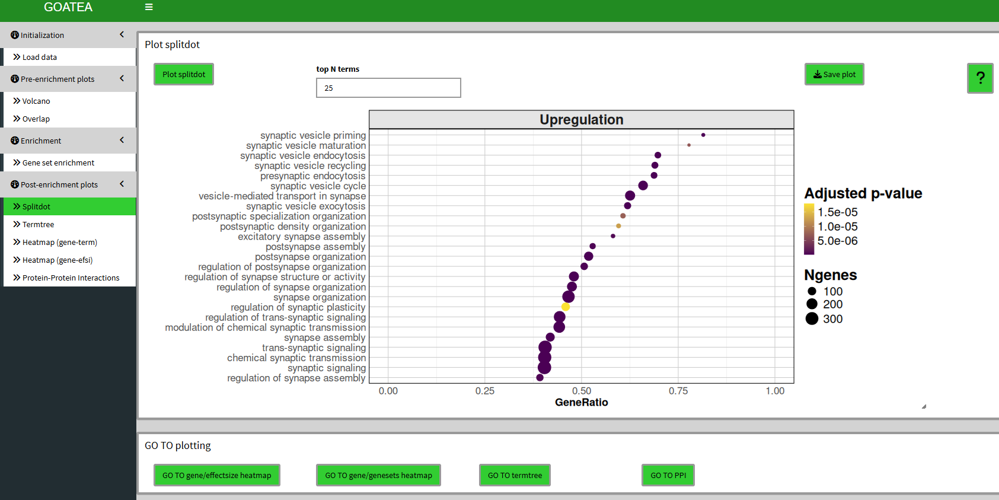
</a>

## Post-enrichment visualization: termtree plot

We 'GO TO termtree', also set 'top N terms' to 25 and drag the slider at the bottom right to the right to scale the plot size.

Unfortunately, due to changes in the enrichplot package I now have to rerun a custom over-representation for all genes versus the selected genesets to create this plot. Meaning to take the p.adjust value with a grain of salt. 

This plot can now be used to have a view of (gene ontology) relationships between genesets, in addition to the splitdotplot. 

<a href="images/GOATEA_GUI_termtree.png" target="_blank" rel="noopener">
  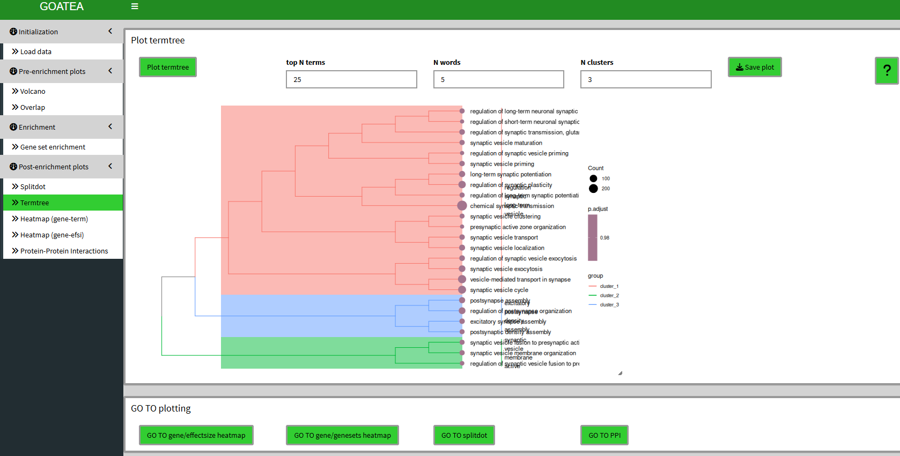
</a>

## Post-enrichment visualization: gene & genesets heatmap

We 'GO TO gene/genesets heatmap', set 'topN terms' to 25 and 'topN genes' to 50 and click 'plot heatmap'. In the large interactive heatmap that appears there is a lot to see. Genes are on top, with their metadata legend on the bottom whereas genesets are on the right with their metadata legend on the left. If a heatmap cell is colored, it means the gene is in the geneset. The coloring defines clusters and both genes and genesets are hierarchically clustered. This is how you can quickly scan for potentially interesting groups of genes within and between genesets. 

<a href="images/GOATEA_GUI_heatmap_gene_genesets.png" target="_blank" rel="noopener">
  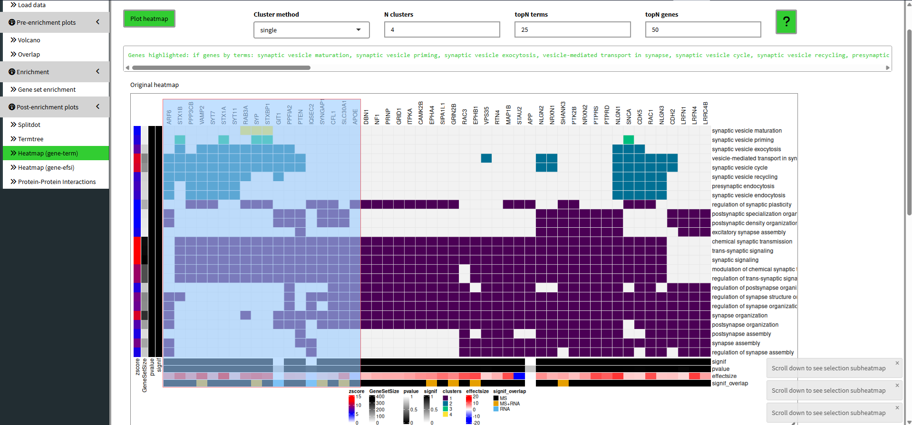
</a>

In the heatmap you can see the mouse dragged selection box. When you scroll down you can now see the subheatmap of this selection and decide to add genes to the selection of genes in different manners. 

<a href="images/GOATEA_GUI_heatmap_gene_genesets_selected.png" target="_blank" rel="noopener">
  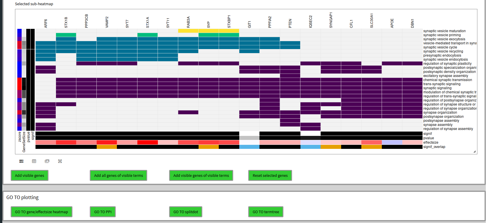
</a>

## Post-enrichment visualization: gene & effectsize heatmap

We 'GO TO gene/effectsize heatmap', set 'plot n genes' to 500 to plot all 484 selected overlapping genes between RNA and MS. Here, the scale difference of effectsize between the samples makes no sense and is therefore purely illustrative. Although, you can see groups of genes by the hierarchical clustering on the left and differences in effectsize coloring to make out potentially interesting groups of genes.

<a href="images/GOATEA_GUI_heatmap_gene_effectsize.png" target="_blank" rel="noopener">
  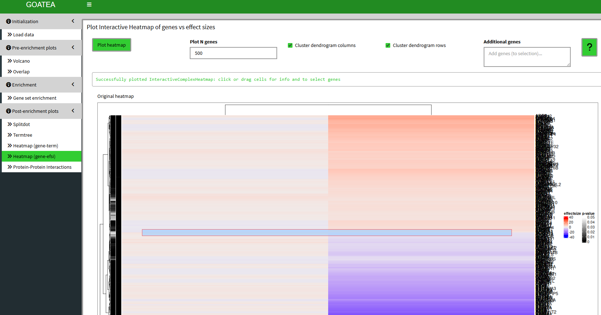
</a>

Similar to the previous heatmap, we can mouse drag a selection box and see the subheatmap below and add the genes to the selection if we so wish.

<a href="images/GOATEA_GUI_heatmap_gene_effectsize_selected.png" target="_blank" rel="noopener">
  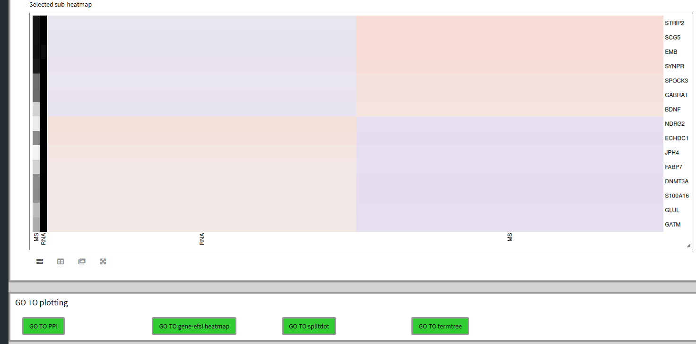
</a>

## Post-enrichment visualization: protein-protein interaction graph

Finally, we 'GO TO PPI' for the bottom-up protein-protein interaction graph of the selected genes/proteins, setting the 'STRINGdb score threshold' to 700 for recommended stringent filtering. The interaction strength is shown by the opacity of the graph edge. 

Graph statistics are displayed below the graph. 

The node borders are by default colored by effectsize. Both nodes and edges can be colored by any of their metadata featues. 

Selected nodes are colored black and white, as shown in the middle. A single protein or cluster can also be selected. 

<a href="images/GOATEA_GUI_PPI.png" target="_blank" rel="noopener">
  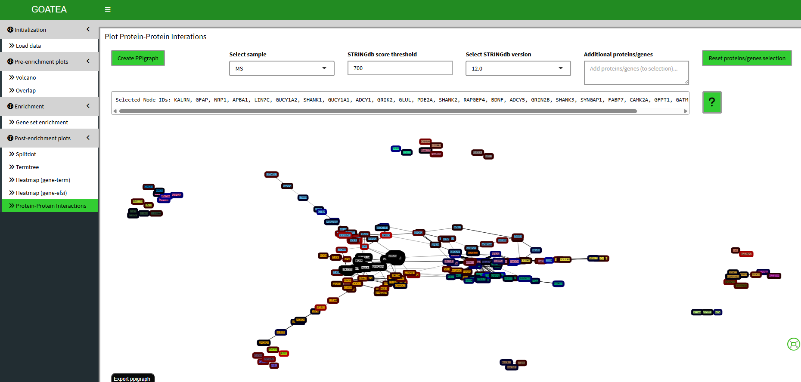
</a>

Selections can then be subgraphed for zoomed inspection. 

<a href="images/GOATEA_GUI_PPI_selected.png" target="_blank" rel="noopener">
  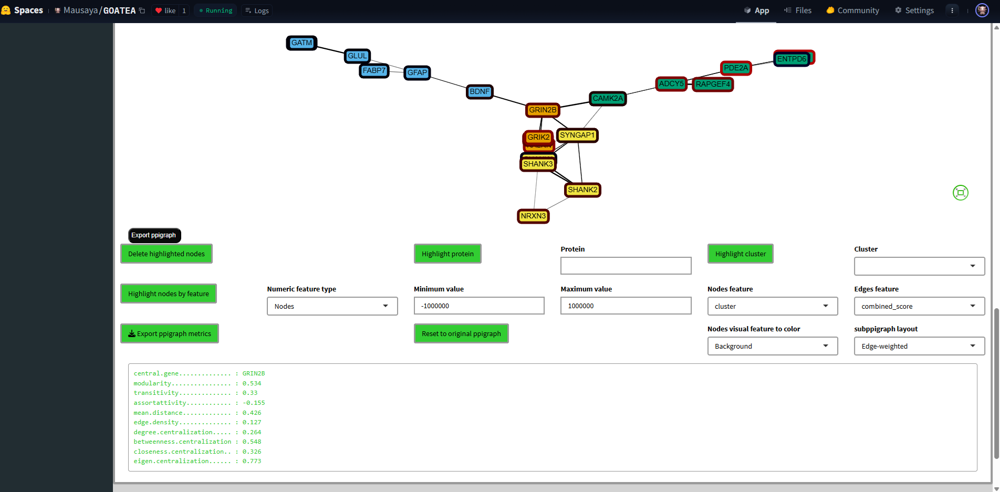
</a>


FYI, graph edges can be clicked to inspect their STRING database interaction information.


<a href="images/GOATEA_GUI_PPI_STRINGdb.png" target="_blank" rel="noopener">
  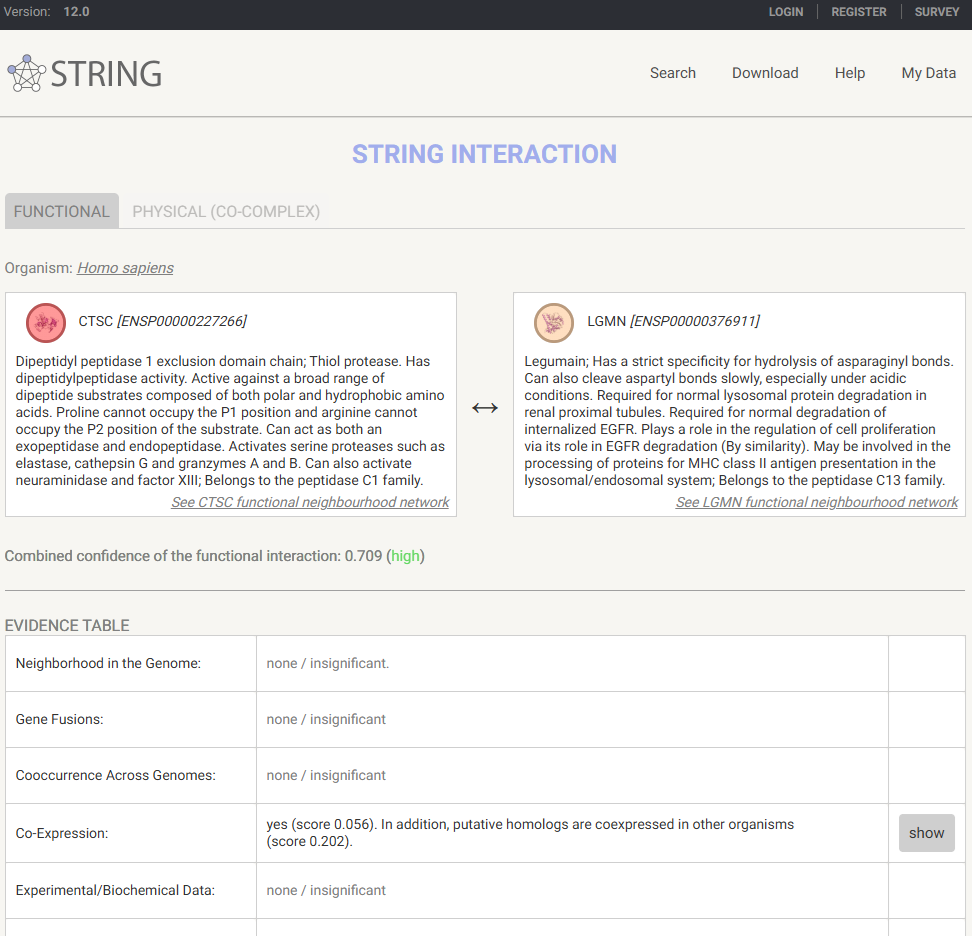
</a>


# Information

A thank you for your time and effort in using goatea, I hope it may aid you in exploring your data! 
  
## Contact 
  
goatea was developed by Maurits Unkel at the Erasmus Medical Center in the department of Psychiatry.
Source code is available through GitHub: https://github.com/mauritsunkel/goatea
Questions regarding goatea can be sent to: mauritsunkel@gmail.com

## License

goatea is licensed under Apache 2.0.

## Issues and contributions

For issues and contributions, please find the goatea Github page: https://github.com/mauritsunkel/goatea/issues

## GOAT reference

Koopmans, F. GOAT: efficient and robust identification of gene set enrichment. Commun Biol 7, 744 (2024). https://doi.org/10.1038/s42003-024-06454-5

## Session info

```{r session_info}
sessionInfo()
```